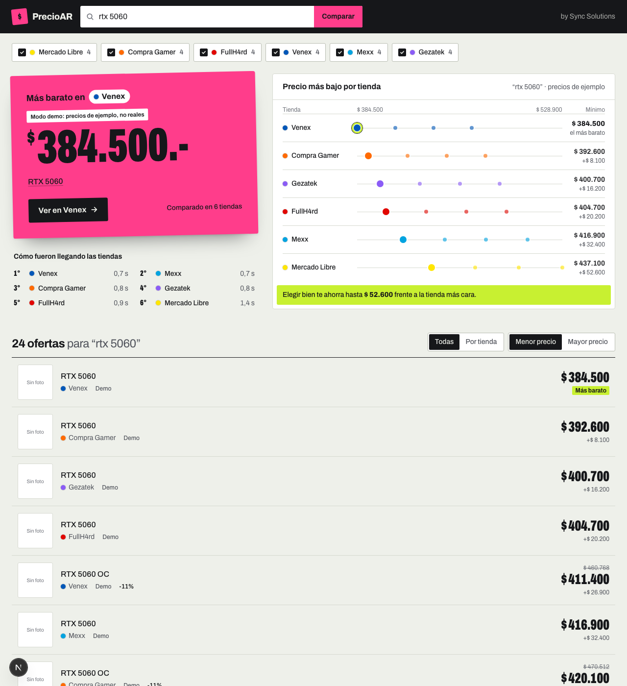

# Pesito — Comparador de precios de hardware

Buscás un producto una vez y ves el precio en **Mercado Libre, Compra Gamer, FullH4rd, Venex, Mexx, Gezatek y Frávega**, con el más barato resaltado y un resumen de precio mínimo por tienda. Además guarda el historial de precios y te avisa por mail cuando algo baja del precio que elegiste.



Además, **Armá tu PC** (`/armar`): elegís pieza por pieza (procesador, mother, RAM, placa de video, disco, fuente y gabinete) al mejor precio, con chequeo de compatibilidad (socket, DDR4/DDR5, potencia de la fuente) y una PC en 3D que se va armando. También puede armarla sola a partir de tu presupuesto y uso, y el armado se comparte por link.

Next.js 16 (App Router) · TypeScript · Tailwind 4 · Cheerio · Three.js · Vitest

## Correr local

```bash
npm install
cp .env.example .env.local   # opcional: Mercado Libre, base de datos, mails
npm run dev                  # http://localhost:3000
```

`DEMO_MODE=1 npm run dev` muestra precios de ejemplo sin consultar ninguna tienda (útil para demos o screenshots).

## Tests

```bash
npm test            # unitarios: texto/precios, parsers con HTML guardado, API en modo demo, lógica del armado
npm run test:live   # smoke test contra las 7 tiendas reales (avisa si alguna cambió su HTML o bloquea la IP)
```

GitHub Actions corre typecheck, lint, tests y build en cada push (`.github/workflows/ci.yml`).

Los fixtures de `tests/fixtures/` son HTML real recortado (Gezatek, Mexx, Venex) o sintético cuando la tienda bloquea scripts (FullH4rd, listado de Mercado Libre).

## Cómo funciona

```
Navegador ──► /api/search/[tienda]?q=...   (una request por tienda, en paralelo)
                    │
                    ├─ cache en memoria 10 min (evita martillar las tiendas)
                    ├─ adapter de la tienda  → Product[]
                    └─ filtro: el título tiene que tener todas las palabras buscadas
```

Cada tienda carga por separado, así la que responde primero aparece primero y si una falla las demás siguen andando.

| Tienda | Cómo se obtiene | Archivo |
|---|---|---|
| Compra Gamer | JSON público del catálogo completo (`static.compragamer.com/productos`, ~2 MB) cacheado 15 min y filtrado en el server | `src/lib/stores/compragamer.ts` |
| FullH4rd | HTML de `/cat/search/{q}` | `fullh4rd.ts` |
| Venex | HTML de `resultado-busqueda.htm` (windows-1252); datos del JSON en `enhancedClick(...)` | `venex.ts` |
| Mexx | HTML de `/buscar/?p=` (deduplica por número de artículo) | `mexx.ts` |
| Gezatek | HTML de `/buscar/?q=`; datos en `data-id / data-nombre / data-precio` | `gezatek.ts` |
| Frávega | HTML de `/l/?keyword=`; el listado sale del JSON de `__NEXT_DATA__` (estado de Apollo) | `fravega.ts` |
| Mercado Libre | API oficial con token (`ML_CLIENT_ID` + `ML_CLIENT_SECRET`); sin credenciales intenta el HTML del listado | `mercadolibre.ts` |

### Mercado Libre

La búsqueda pública de la API (`/sites/MLA/search`) devuelve **403 sin token**, y el listado web suele pedir login a tráfico automatizado. Para que ML funcione bien:

1. Creá una app en <https://developers.mercadolibre.com.ar/devcenter>.
2. Copiá `Client ID` y `Client Secret` a `.env.local`.

Si la búsqueda sigue en 403 con token, el adapter usa el catálogo (`/products/search` + precio de la buy box).

### Armado de PC

| Qué | Dónde |
|---|---|
| Categorías y filtros (descarta combos, servicios, accesorios y precios fuera de escala) | `src/lib/builder/parts.ts`, `build.ts` |
| Specs leídas del título: socket, DDR, watts, gráficos integrados | `src/lib/builder/specs.ts` |
| Compatibilidad y avisos | `src/lib/builder/compat.ts` |
| Armados de referencia por uso y búsqueda del que entra en el presupuesto | `src/lib/builder/presets.ts` |
| Escena 3D (Three.js, se carga aparte) | `src/components/pc3d/` |

Las tiendas no publican specs estructuradas, así que la compatibilidad es una heurística sobre el título: cuando no se puede leer, la UI pide verificar en la tienda.

### Historial y alertas de precio

Cada búsqueda guarda el precio más bajo del día por tienda (`/api/historial` arma el gráfico). Con `DATABASE_URL` se usa Postgres (las tablas se crean solas); sin eso, un archivo en `.data/`.

Las alertas ("avisame si baja de $X") no piden cuenta:

1. `POST /api/alertas` la crea **pendiente** y manda un mail con el link de confirmación (Resend). Así nadie puede anotar el mail de otro.
2. El link abre `/api/alertas/confirmar`, que pide apretar un botón: los servidores de mail que abren links para revisarlos no la activan solos.
3. `/api/cron` corre una vez por día (`vercel.json`): vuelve a buscar lo que se sigue, de a tandas y con tiempo límite; lo que no entra sigue al otro día, empezando por lo revisado hace más tiempo.
4. Cada mail trae el link de baja (`/api/alertas/baja`).

Límites contra abuso: 5 alertas por hora por IP, 3 mails de confirmación por día al mismo mail y 20 alertas activas por mail. El ranking de armados populares valida cada armado y lo cuenta una vez por día por IP.

### Agregar una tienda

1. Crear `src/lib/stores/mitienda.ts` exportando un `StoreAdapter` (`search(query, limit) → Product[]`).
2. Sumarlo al `StoreId` en `types.ts`, a `meta.ts` (nombre/color) y a `ADAPTERS` en `stores/index.ts`.

Maximus quedó afuera por ahora: arma el listado con PageMethods de ASP.NET + sesión, así que necesita un navegador headless.

## Deploy

Funciona en Vercel o Render. Para el historial y las alertas en producción hacen falta `DATABASE_URL`, `RESEND_API_KEY` y `CRON_SECRET` (ver `.env.example`): sin `CRON_SECRET` el cron no corre, y sin base o sin mails no se pueden crear alertas. Tené en cuenta que algunas tiendas (FullH4rd y Maximus usan Cloudflare) pueden bloquear IPs de datacenter; si pasa, la tienda aparece con "error" y las demás siguen andando.

## Aviso

Proyecto de portfolio. Los precios se leen de los sitios públicos de cada tienda y pueden cambiar; siempre hay que verificar en el sitio. Si una tienda cambia su HTML, hay que actualizar su adapter.

---

Hecho por **Eduardo Velazques** — [Sync Solutions](https://instagram.com/sync.tuc)
